# 🎮 [시로의 복수]

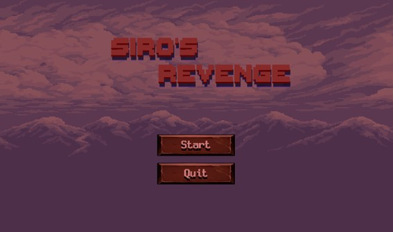 <!-- 게임 대표 이미지 -->

## 📝 소개

[시로의 복수] 게임은 [2D] 장르의 [플랫폼(PC)]용 게임으로, [대학교 팀 프로젝트 과제]로 [3개월] 개발기간 동안 [Unity] 엔진을 이용해 진행되었습니다.

>  ["6인 개발(기획2, 아트1, 클라3)", "클라이언트 전투 담당"]으로 제작한 포트폴리오 작품입니다.

## 🎮 조작 방법

| 키/버튼 | 동작 설명         |
|--------|------------------|
| W/A/S/D | 이동              |
| Space | 상호작용 / 공격 |
| Q/W/E/R/T | 스킬 사용 |

## 🖼️ 스크린샷

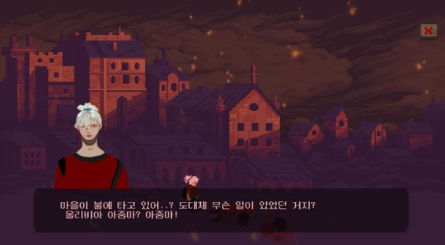
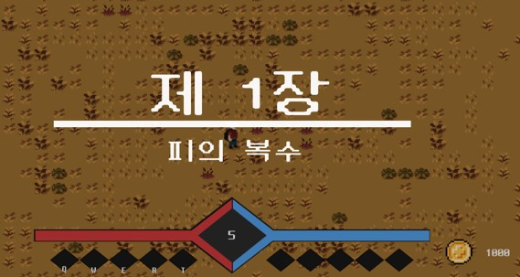
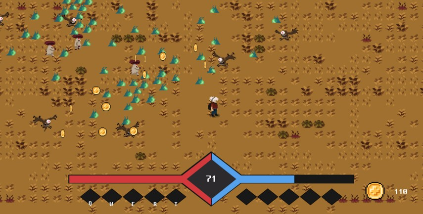
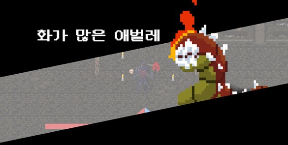
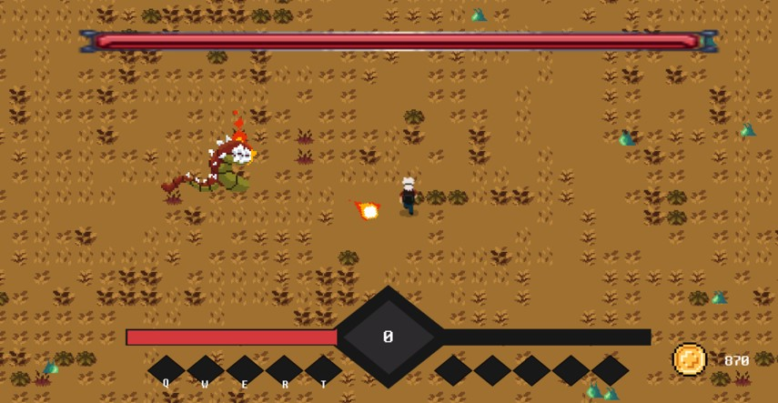
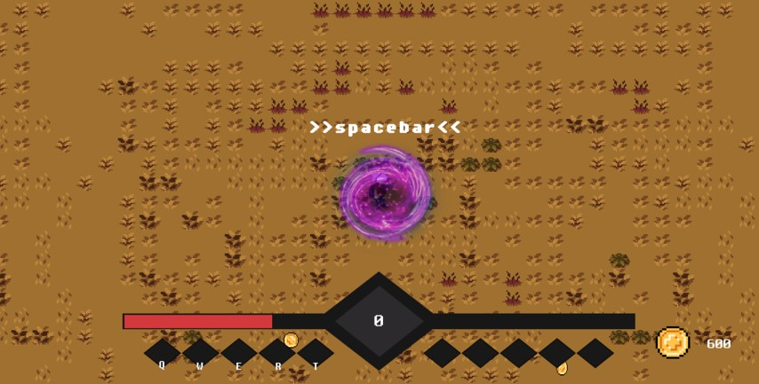
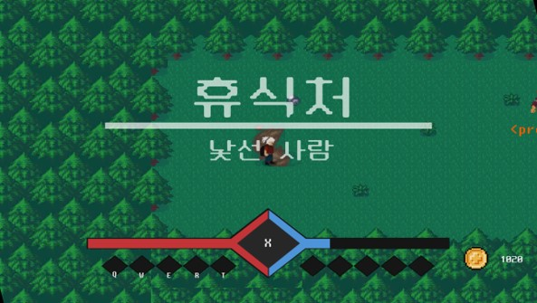
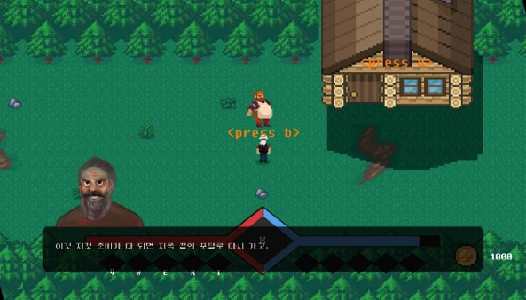
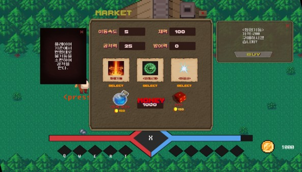
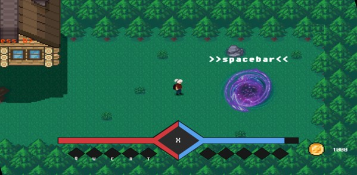
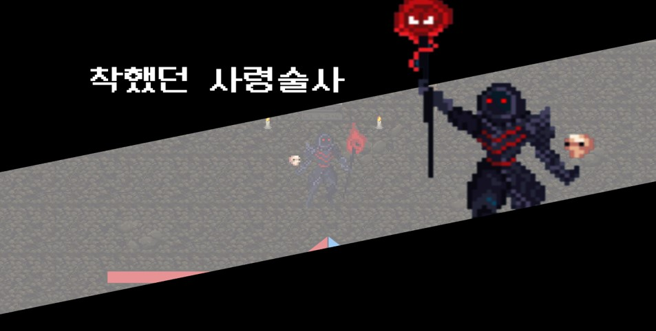
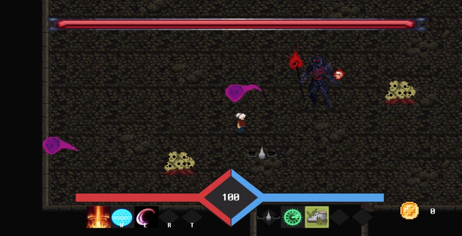
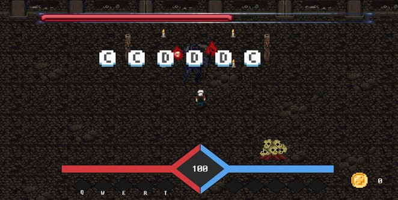
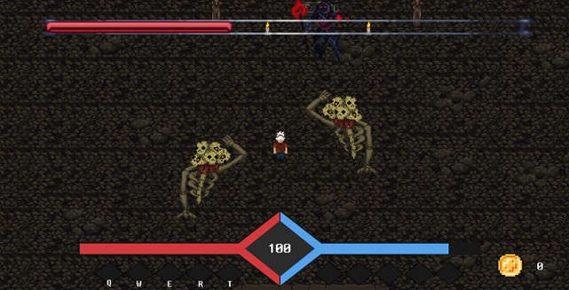

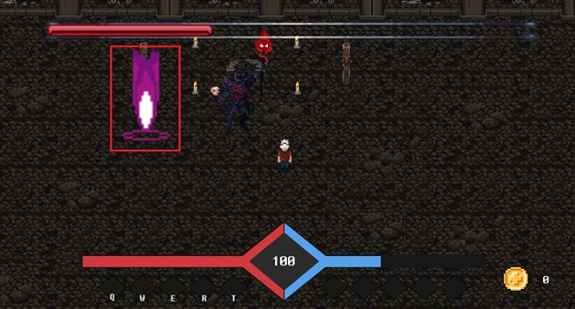

## 🛠️ 사용 기술

- Unity5
- C#
- Git, Source Tree

## 📦 다운로드

> Google Drive 다운로드 링크

[🔗 구글 드라이브](https://yourgame.itch.io)
